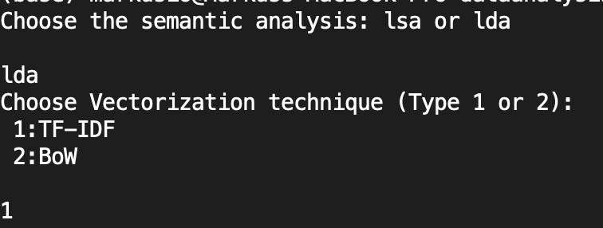
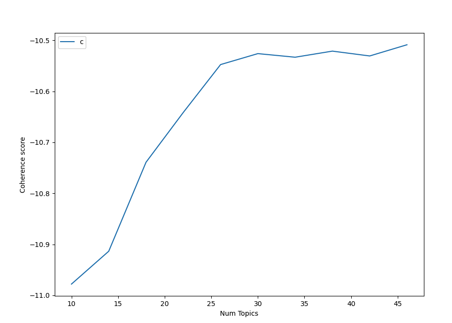
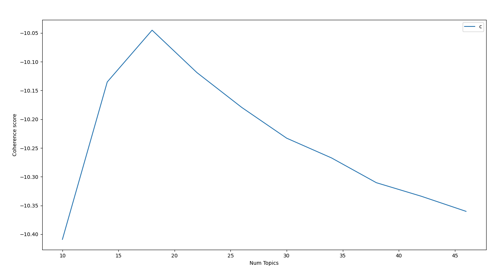
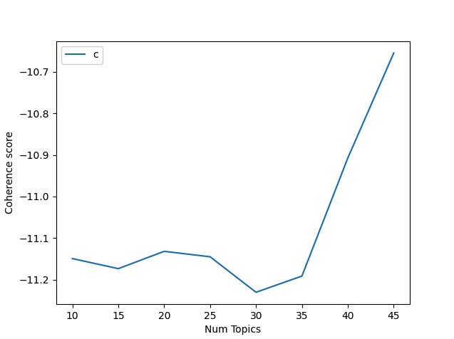

# Run Code

### MacOS
``` bash
cd <Your Location>/YoutubeDataAnalysis/DataAnalysisYoutube/dataanalysis
```
### Microsoft PowerShell
```powershell
cd ./<Your Location>/YoutubeDataAnalysis/DataAnalysisYoutube/dataanalysis
```
### Microsoft Command Prompt
```command prompt
cd <Your Location>/YoutubeDataAnalysis/DataAnalysisYoutube/dataanalysis
```

## Install all dependencies
``` bash
pip install -r requirements.txt
```

## Start program
```bash
python3 Analysis.py
```

# Runtime Example
The program requires user interaction to complete. It will require the user to enter the type of semantic analysis (lsa or lda) and the vectorization technique ((1)TF-IDF or (2)BoW). The following image shows an example of input:



# Code Description
Thorughout the code there are multiple lines that are commented out. These are highly relevant to the project. 
However, to lower the runtime, they are commented out to ensure it does not take too long to run each time. 

### Examples
#### Coherence Scores
##### LSA
LSA with BoW

LSA with TF-IDF


##### LDA
LDA with TF-IDF



