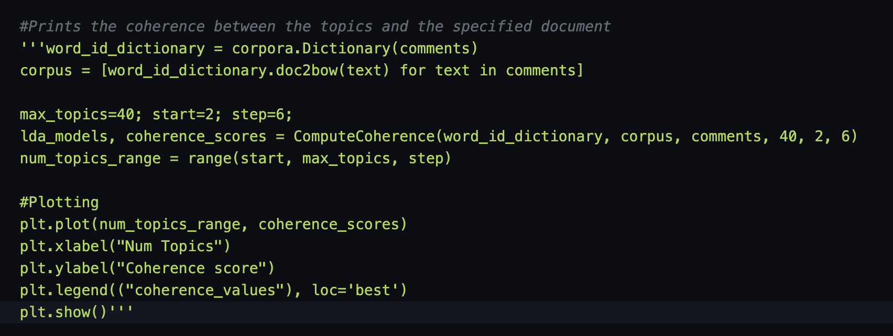
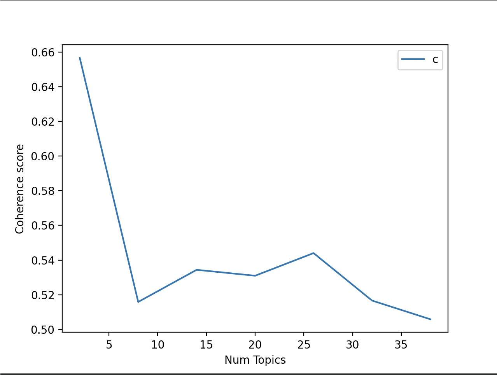

# Run Code
### For MacOS
``` bash
cd <Your Location>/YoutubeDataAnalysis/DataAnalysisYoutube/dataanalysis
```
### Microsoft PowerShell
```powershell
cd ./<Your Location>/YoutubeDataAnalysis/DataAnalysisYoutube/dataanalysis
```
### Microsoft Command prompt
```command prompt
cd <Your Location>/YoutubeDataAnalysis/DataAnalysisYoutube/dataanalysis
```

## Start program
```bash
python3 Analysis.py
```

# Code Description
Thorughout the code there are multiple lines that are commented out. These are highly relevant to the project. 
However, to lower the runtime, they are commented out to ensure it does not take too long to run each time. 

### Example


Here, the code has been commented out. Altough this code has been run, with the following result:


It is not required to run this snippet for every runtime of the program.


