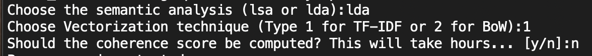

# Run Code

### MacOS
``` bash
cd <Your Location>/YoutubeDataAnalysis/DataAnalysisYoutube/dataanalysis
```
### Microsoft PowerShell
```powershell
cd ./<Your Location>/YoutubeDataAnalysis/DataAnalysisYoutube/dataanalysis
```
### Microsoft Command Prompt
```command prompt
cd <Your Location>/YoutubeDataAnalysis/DataAnalysisYoutube/dataanalysis
```

## Install all dependencies
``` bash
pip install -r requirements.txt
```

## Start program
```bash
python3 Analysis.py
```

# Runtime Example
The program requires user interaction to complete. It will require the user to enter the type of semantic analysis (lsa or lda) and the vectorization technique ((1)TF-IDF or (2)BoW). 
Lastly, it will ask if the program should calculate coherence scores.
The following image shows an example of input:



# Code Description

#### Coherence Scores
The coherence scores for all four models have been computed. 
As shown in the Runtime Example section above, the user can opt to perform the same calculation.
If this is unwanted, take a look at the results below.

##### LSA
LSA with BoW

LSA with TF-IDF


##### LDA
LDA with TF-IDF

LDA with BoW


